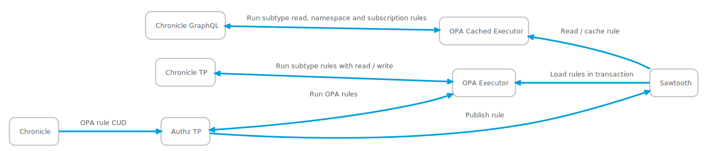
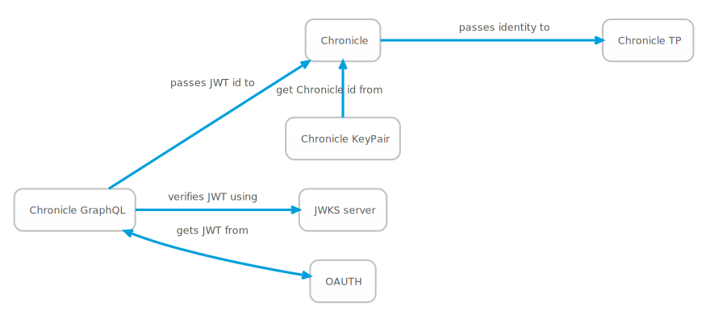
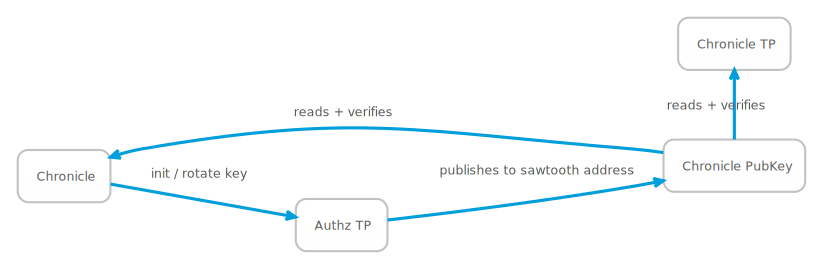

# Authentication and authorization



Goals:

* Verifiable identity as first class concept in Chronicle
* Identity used for chronicle operations emitted as an event field
* Key rotation, recorded on backend ledger
* Sawtooth keys can become ephemeral transport, not identity
* OPA rules maintained by a dedicated TP
* Minimise OPA entrypoints, no implementation or domain knowledge required to
  discover rule addresses
* OPA rule alteration secured by cryptographic id
* OPA used to secure graphql queries within Chronicle, using an async_graphql extension
* OPA used to secure chronicle operations, within the Chronicle TP
* Efficient execution of current OPA rules in multiple Chronicle components
* Preservation of existing zero config devmode

## Chronicle auth tp

Chronicle authorization and authentication is controlled by a dedicated
transaction processor. It has the following responsibilities:

* Registration of the initial chronicle public key during service provisioning
* Registration of new chronicle public keys when rotated
* Initialization of default OPA rules
* CUD operations on OPA rules
* OPA policy checks to determine whether a JWT identity can edit or create a
  rule - the Chronicle identity is a superuser and authorization rules are not applied.
* Publication of rules and the current Chronicle public key to the Chronicle
  sawtooth namespace, so that they are accessible by the chronicle TP

## Identity



Identity supplied to the OPA or Chronicle TP is either `Chronicle` -
representing a superuser, or a JWT, sent by a client to Chronicle and verified
by JKMS. Identity is supplied to the Chronicle AuthZ TP as message fields, and
to the Chronicle TP as an `Identity` operation - a union type of `Chronicle` and
`JWT`.  This is represented as a tagged union when serialized to JSON for OPA.

These identity objects should be verifiable independently of the messages they
are contained in - they will be sent and consumed by multiple components.  The
idea here is to be able to echo enough back in commit events for a
process to be able to verify the identities used in the transaction.

```json
{
  "identity" : {
    "typ" : "key",
    "id" : "chronicle",
    "key": "{current chronicle public key}",
    "sig": "{signature of this identity message}"
  }
}
```

```json
  "identity" : {
    "typ" : "JWT",
    "identity" "john@johndoe.com",
    "key": "{current chronicle public key}",
    "sig": "{signature of this identity message}"
  }
}
```

### Chronicle key generation



During the provisioning process for Chronicle, a key pair is generated and
stored in secure storage. The public part is sent to the Chronicle AuthZ TP in
an `InitialIdentity` transaction. This sets `chronicle-authz:chronicle-identity`
to the supplied public key, as well verifying the transaction signature. This
transaction will only succeed when `chronicle-authz-chronicle-identity` has not
yet been set. No other Chronicle AuthZ TP transactions can succeed until this
has taken place, and it can only be processed once.

### Chronicle key rotation

Chronicle may rotate the key stored in `chronicle-authz-chronicle-identity`, by
sending a `RotateKey` transaction. This checks the public key in the transaction
header matches the *current* value of `chronicle-authz-chronicle-identity`,
supplying the new public key in the transaction proper. This briefly requires
access to the old and new key pairs.

Chronicle transactions in flight may fail during key rotation, so signature
errors should be treated as resumable within a reasonable time window of any key
rotation operation. We could prevent this by doing our own windowing and storing
previous keys, but this adds complexity.

### Chronicle transaction verification

Addittional public key and signature fields will be added to the chronicle
transaction envelope for the Chronicle key. An additional verification stage
here will allow us to use ephemeral keys for sawtooth and make identity an
explicit function of chronicle.

As well as checking that the chronicle envelope signature is valid, chronicle
will also check that the supplied public key matches the currently public key
published by the Chronicle AuthZ TP to `chronicle-authz:chronicle-identity`.

### OPA rule addresses and schema

Are of the form `chronicle-authz:opa:{namespace}`

Where namespace is a Chronicle namespace.

The following parameters are passed to the OPA rule at this location, when an
OPA CUD transaction is attempted.

#### Identity

The tagged union described in [identity](#identity).

#### Origin

One of `cli` or `graphql`

#### Operation

One of `create`, `update` or `delete`.

##### Securing subscriptions

The existing interface

```graphql
type Subscription {
  commitNotifications: CommitNotification!
}

```

Needs to be split into a global commit notification channel for service
composition and a reply channel for notifying standard API clients when
operations are committed or failed. This requires some additional state to
determine which subscription is waiting on which outstanding tx. The reply
channel CommitNotification object can also drop the delta component.

```graphql
type CommitNotification {
  stage: Stage!
  txId: String!
  error: String
}

type SystemNotification {
  stage: Stage!
  txId: String!
  error: String
  delta: Delta
}

type Subscription {
  systemNotifications: SystemNotification!
  commitNotification: CommitNotification!
}

```

A per-namespace subscription rule stored at `chronicle-authz:{namespace}:subscription`

##### Default policy

`chronicle-authz:{namespace}:default-policy`

Provisioned at installation to be default allow.

##### Chronicle policies

Are of the form `chronicle-authz:{namespace}:chronicle`

Where namespace is a Chronicle namespace and `kind` is one of `entity` `agent`
`activity` or `namespace`

`chronicle-authz:d61552ba-cf83-4bbd-9938-10c90584ecbe:chronicle:entity:Revision`

Would authorise operations on Revision entities

#### Subtype rule schema

##### Identity

The tagged union described in [identity](#identity).

##### Origin

One of `cli` or `graphql`

##### Operation

One of `read` `write` or `introspect`. `introspect` governs schema visibility,
`read` for all graphql query operations and the dependencies of chronicle
operations.`write` for write operations. Dependencies of write transactions
 should be verified for read permissions.

##### Object

The compact json-ld representation of the object


#### Rule application

OPA CUD rules are applied in the Chronicle AuthZ TP. OPA rules are applied both
in Chronicle - for graphql query and subscription operations and in the
Chronicle TP - for `ChronicleOperations` sent by the API.

### Identity via GraphQL

Chronicle's graphql server accepts a JWT in the Authorization header, that it
will verify using JKMS.

### Identity via CLI

The CLI operates as a superuser, as it has access to key material.

### Performance and correctness

OPA rule application within Chronicle for graphql will not always be consistent
with the current OPA rule state without performance loss. Read-through caching
of rules and sawtooth event (on OPA changes) driven eviction gives reasonable
consistency.

As we do not pass object identifiers to OPA, rule checks can be memoized within
a transaction or graphql request.

### Chronicle in memory / dev mode

We need to add another feature flag to chronicle `allow-anonymous`, and combine
it and `in-mem` into antother feature `dev-mode`.

When compiled in `allow-anonymous` mode, unidentified graphql queries, mutations and
subscriptions will use the `Chronicle` identity. Compiled without this feature, all
unidentified operations will be denied, except via the CLI - that requires access
to private key material and therefore can legitimately identify as a superuser.
`dev-mode` should remain a configuration and docker free experience as far as this is
possible.

### Chronicle OPA CLI

Chronicle CLI should be extended to support OPA CUD and key rotation.

Chronicle should also be able to bootstrap OPA rules to ensure that every potential
operation has a rule or things will be rather painful for devops.

Return the rule at the specified IRI:

`chronicle opa get [entity|agent|activity|namespace|opa]`

Validate the .wasm rule specified by path then update the rule

`chronicle opa put [entity|agent|activity|namespace|opa] path`

All opa operations take an optional --namespace, with the usual default
behaviour if not specified.

Generate a new keypair in configured storage and initialise the AuthZ TP:

`chronicle key init`

Generate a new keypair, register it with the AuthZ TP and then store it:

`chronicle key rotate`

(At some point these will be vault / KMS / etc backed operations, but we can
carry on using the current method for now)

# Chronicle OPA graphql

This is of lower priority, but the CLI OPA operations should also be available
as graphql queries and mutations.
