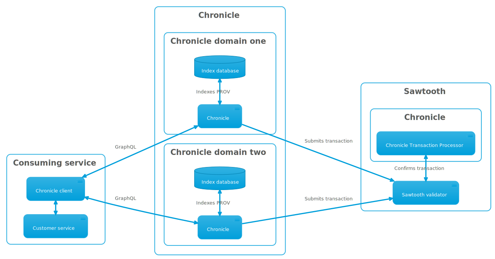
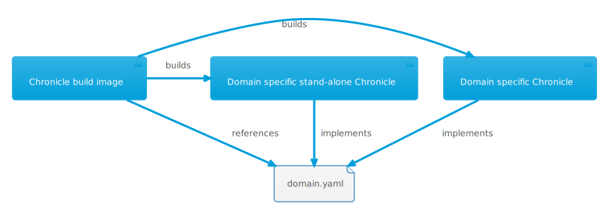
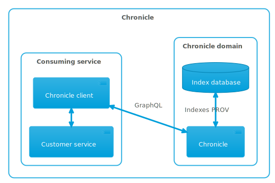
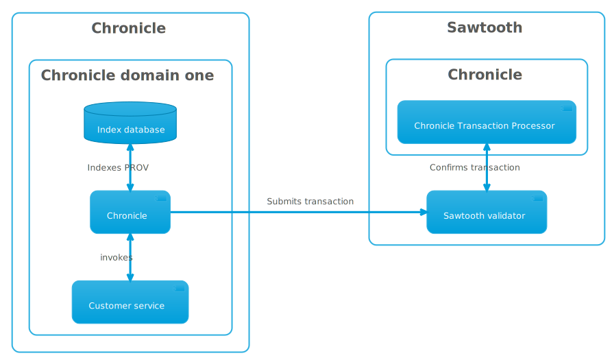

# Chronicle Architecture

Chronicle is an API toolkit that can be customized to your provenance domain and
easily deployed to Kubernetes along with a distributed ledger using
[Sextant](https://btp.works/sextant).

## Chronicle and Hyperledger Sawtooth

When deployed with Sawtooth, Chronicle has two components - the transaction
processor, responsible for ensuring provenance recorded by Chronicle does not
contradict itself, and Chronicle running as a domain-specific GraphQL API.
Multiple Chronicle domains can share the same Sawtooth ledger and transaction
processor, and other Sawtooth applications can also make use of the same ledger
being used for provenance. Chronicle, Sawtooth, and the Chronicle transaction
processor can all scale independently within a Kubernetes cluster.

## Chronicle for Your Domains

Chronicle is supplied as a [docker build image](./building.md) and requires the
creation of a [domain model](./domain_modeling.md) and CI / CD to build a
domain-specific API. This build image is completely self-contained, requires no
network access for dependencies, and can be used in secure environments.

## Stand-alone Chronicle

For friction-free development and testing, without the need for a backend ledger,
domain-specific versions of Chronicle can be built in the same CI / CD process
as your production version. Chronicle will use an embedded database and can be
started with an [embedded GraphQL IDE](./cli.md#serve-graphql).

## Chronicle as a CLI

For ETL and legacy integration scenarios where it is impractical to create a
GraphQL client application, Chronicle can record provenance from its
[CLI](./cli.md). Deployment is similar to when operating as a GraphQL server,
but your application code must execute in the same container as Chronicle. This
kind of deployment can operate side by side with GraphQL.

