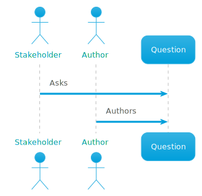
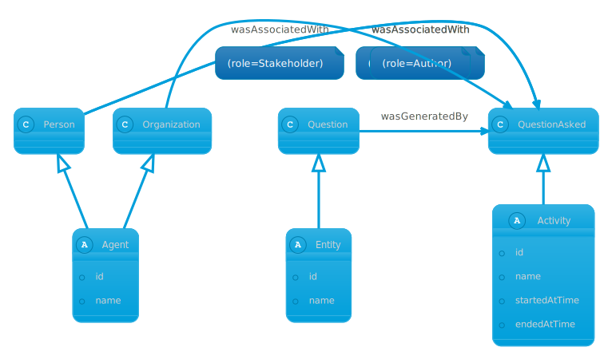
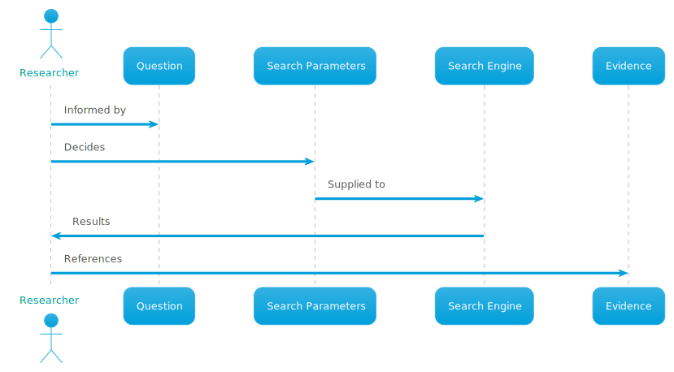
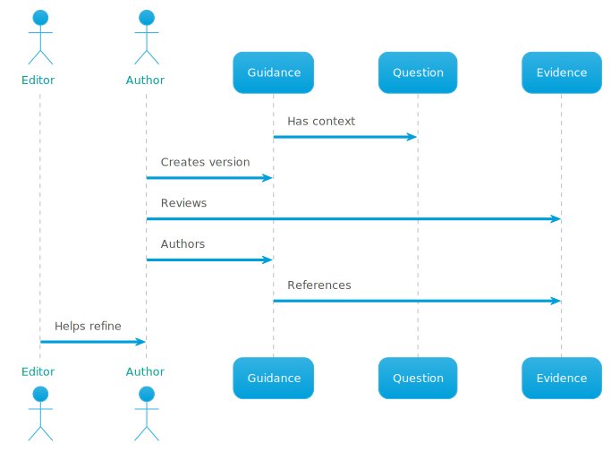
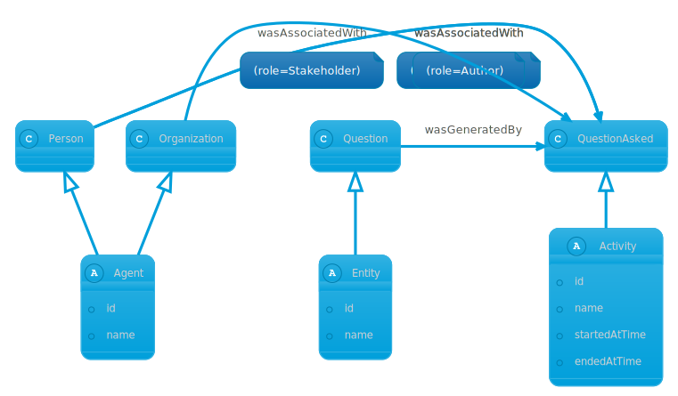
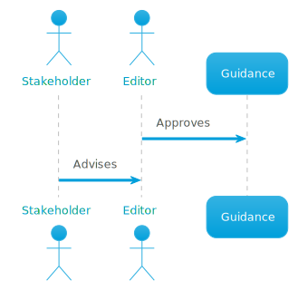
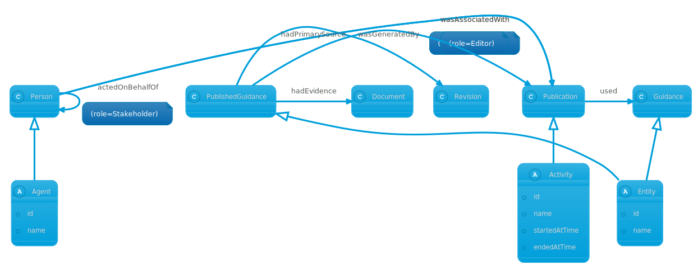

# Modelling a provenance domain with Chronicle

Here we will present a reference domain that uses all the provenance features
Chronicle provides and work through the process of representing it using
Chronicle's domain modelling syntax. This should help you both understand
Chronicle's capabilities and translating your own problem domain's provenance.

Chronicle uses the [W3C Provenance Ontology](https://www.w3.org/TR/prov-o/) as
the basis for provenance modelling.

## Reference domain - Medical evidence

This is a toy model of some aspects of evidence based medicine, from an initial
`Question` - the area and scope that the organization wishes to research and
make guidance on to revisions of a published `Guidance` document. The system is
currently handled by a content management system that has identities for
documents and users, and we will use Chronicle to add provenance capabilities.

### Question creation

The question for medical evidence can vary pretty widely, but for the purposes
of this example imagine it as something along the lines of "How best to assess
and refer patients who have required emergency treatment for Anaphylaxis".

Various actors and processes are involved in the production of the question, but
for our purposes we van view it like this:



The `Question` is then used to inform the `Research` for the production of
`Guidance`.

To model and record this process you will need the Chronicle domain model
definition explained here, along with the following operations:

- [question](./recording_provenance.md/#define-an-entity) - define an Entity of
  subtype Question
- [questionAsked](./recording_provenance.md#define-an-activity) - define an
  Activity of subtype QuestionAsked
- [person or organization](./recording_provenance.md#define-an-agent) - define
  an Agent of subtype Person or Organization to act as  Stakeholders
- [person](./recording_provenance.md#define-an-agent)  - define an Agent of
  subtype Person to act as Authors
- [wasGeneratedBy](./recording_provenance.md/#generation) - specify that the
  QuestionAsked Activity produced the Question
- [wasAssociatedWith](./recording_provenance.md/#association) - specify that the
  Person who authored and the Organizations that asked
- [endedAtTime](./recording_provenance.md/#ended-at-time) - specify the question
  was asked at a point in time

This process represented as provenance will look like:



### Research

The `Question` is used to inform one or more searches to a search engine by a
researcher, the parameters to the search engine are recorded, and the results
are used to create references to `Evidence`.



To model and record this process you will need the Chronicle domain model
definition explained here, along with the following operations:

- [question](./recording_provenance.md/#define-an-entity) - define an Entity of
  subtype Question
- [evidence](./recording_provenance.md#define-an-entity) - define an Entity of
  subtype Evidence
- [researched](./recording_provenance.md#define-an-activity)  - define an
  Activity of subtype Researched
- [person](./recording_provenance.md#define-an-agent)  - define an Agent of
  subtype Person
- [used](./recording_provenance.md/#usage) - specify that the Research Activity
  used the Question
- [wasGeneratedBy](./recording_provenance.md/#generation) - specify that the
  Research Activity produced the Evidence
- [wasAssociatedWith](./recording_provenance.md/#association) - specify that the
  research was done by a Person acting as a researcher
- [startedAtTime](./recording_provenance.md/#started-at-time) - specify the
  research began at a point in time
- [endedAtTime](./recording_provenance.md/#ended-at-time) - specify the research
  ended at a point in time

This process represented as provenance will look like:


### Revision

Guidance, like authorship is triggered by research - in this case for changes or
additions to the evidence base. Evidence is used to inform a new revision of the
Guidance document



To model and record this process you will need the Chronicle domain model
definition explained here, along with the following operations:

- [question](./recording_provenance.md/#define-an-entity) - define an Entity of
  subtype Question
- [guidance](./recording_provenance.md#define-an-entity) - define an Entity of
  subtype Guidance
- [evidence](./recording_provenance.md#define-an-entity) - define an Entity of
  subtype Evidence
- [revised](./recording_provenance.md#define-an-activity)  - define an Activity
  of subtype Revised
- [used](./recording_provenance.md/#usage) - specify that the Guidance Activity
  used the Question
- [used](./recording_provenance.md/#usage) - specify that the Guidance Activity
  used the Evidence
- [wasGeneratedBy](./recording_provenance.md/#generation) - specify that the
  Guidance Activity produced the Guidance
- [wasAssociatedWith](./recording_provenance.md/#association) - specify that the
  research was done by a Person acting as a researcher
- [wasRevisionOf](./recording_provenance.md/#revision) - specify that the
  Guidance is possibly a Revision of previous Guidance
- [hadPrimarySource](./recording_provenance.md/#primary-source) - specify that
  the Guidance possibly has a primary source of the Question (for the first
  version)
- [startedAtTime](./recording_provenance.md/#started-at-time) - specify the
  Guidance process began at a point in time
- [endedAtTime](./recording_provenance.md/#ended-at-time) - specify the Guidance
  process ended at a point in time

This process represented as provenance will look like:



### Publication

A version of Guidance can be approved for Publication by one or more Editors or
Stakeholders. Publication produces a digital artifact that can be signed.



- [guidance](./recording_provenance.md#define-an-entity) - define an Entity of
  subtype Guidance
- [publishedGuidance](./recording_provenance.md#define-an-entity) - define an
  Entity of subtype PublishedGuidance
- [evidence](./recording_provenance.md#define-an-entity) - define an Entity of
  subtype Evidence
- [published](./recording_provenance.md#define-an-activity)  - define an
  Activity of subtype Published
- [used](./recording_provenance.md/#usage) - specify that the Published Activity
  used the Guidance
- [wasGeneratedBy](./recording_provenance.md/#generation) - specify that the
  Published Activity produced the PublishedGuidance
- [wasAssociatedWith](./recording_provenance.md/#association) - specify that the
  Publication was done by a Person acting as an Editor
- [actedOnBehalfOf](./recording_provenance.md/#delegation) - specify that the
  Publication was done by on behalf of on or more Stakeholders
- [hadPrimarySource](./recording_provenance.md/#primarySource) - specify that
  the PublishedGuidance has a primary source of the Guidance
- [endedAtTime](./recording_provenance.md/#ended-at-time) - specify the
  Published process happened at a point in time
- [hadEvidence](./recording_provenance.md/#had-evidence) - attach a signature of
  the published PDF document to the PublishedGuidance activity

This process represented as provenance will look like:



## Conceptual design

Provenance is *immutable*. Once you have recorded it there is no way to
contradict the provenance you have recorded. When translating your domain to
provenance, your activities should be things that have either already take
place, or in progress - so choose the past tense. From the process descriptions
above we can create the following provenance domain:

### Required attributes

#### Content

Plaintext content of an external resource.

#### CmsId

An opaque identifier from the Cms being used to author and publish documents.

#### Title

A plain text title.

#### SearchParameter

The input to a search engine.

#### Reference

A [BibTex](http://www.bibtex.org/) reference to evidence.

#### Version

A simple incrementing integer representing a version number

### Entities

> In PROV, things we want to describe the provenance of are called entities and
> have some fixed aspects. The term "things" encompasses a broad diversity of
> notions, including digital objects such as a file or web page, physical things
> such as a mountain, a building, a printed book, or a car as well as abstract
> concepts and ideas. An entity is a physical, digital, conceptual, or other
> kind of thing with some fixed aspects; entities may be real or imaginary.

When determining entities, a useful approach from [process
mapping](https://www.bpmleader.com/2012/07/23/introductory-guide-to-process-mapping-modelling/)
is to look for nouns in your analysis. Provenance modelling is no different. We
can identify the following Entities.

#### Question

The initial question that forms the basis of all research, informing guidance
via research.

Has attributes:

- CmdId
- Content

#### Evidence

A reference to evidence gathered from a search engine.

Has attributes:

- SearchParameter
- Reference

#### Guidance

The source text of a document, either in the process of authoring or potentially
published.

Has attributes:

- Title
- Guidance

#### PublishedGuidance

A published guidance document, containing a digital signature of the released
PDF.

Has no attributes.

### Activities

> An activity is something that occurs over a period of time and acts upon or
> with entities; it may include consuming, processing, transforming, modifying,
> relocating, using, or generating entities. Just as entities cover a broad
> range of notions, activities can cover a broad range of notions: information
> processing activities may for example move, copy, or duplicate digital
> entities; physical activities can include driving a car between two locations
> or printing a book.

When determining activities, a useful approach from [process
mapping](https://www.bpmleader.com/2012/07/23/introductory-guide-to-process-mapping-modelling/)
is to look for verbs in your analysis. Provenance modelling is similar, except
we are modelling things that have taken place or are in-progress. It is useful
to use past tense for this reason. We can identify:

#### QuestionAsked

The first Activity we need to record, it will Generate a Question.

#### Researched

This activity will model the use of a search engine by a Researcher to produce
Evidence.

#### Revised

This activity will model authorship and refinement by an Editor of a single
revision of guidance, informed by the Question and Evidence from research.

#### Published

This activity models the publication of a particular revision of Guidance,
approved by an editor under the advice of stakeholders.

### Agents

> An agent is something that bears some form of responsibility for an activity
> taking place, for the existence of an entity, or for another agent's activity.

For our example domain, actors are best modelled as Roles rather than Agents -
People and Organizations can participate in multiple ways. So we will specify
the following agents:

#### Person

An individual person

#### Organization

A named organization consisting of one or more persons, the details of the
organizational model are not required to be recorded in provenance.

### Roles

When participating in activities, when either directly responsible or via
delegation, Agents can have a Role. Agents form the who, whereas Roles are the
'what'. Agents may have multiple roles in the same Activity. From our example
domain we can identify the following roles:

#### Stakeholder

A stakeholder is an Organization or Person involved in the formulation of a
Question and the approval of Publication.

#### Author

An Author is a Person who creates a Guidance of Guidance supervised by an
Editor.

#### Researcher

A researcher is a Person who submits SearchParameter to a search engine and then
creates References to Evidence.

#### Editor

An editor is a Person who approves Publication after consulting one or more
Stakeholders and supervises Authors creating Guidances of Guidance.

## Domain model format

We will now translate this conceptual design into Chronicle's domain modelling
syntax. Chronicle domain models are specified in YAML, a complete model for the
conceptual design can be written like this:

```yaml
name: 'evidence'
attributes:
  Content:
    type: String
  CmsId:
    type: String
  Title:
    type: String
  SearchParameter:
    type: String
  Reference:
    type: String
  Version:
    type: Int
entities:
  Question:
    attributes:
      - CmsId
      - Content
  Evidence:
    attributes:
      - SearchParameter
      - Reference
  Guidance:
    attributes:
      - Title
      - Version
  PublishedGuidance:
    attributes: []
activities:
  QuestionAsked:
    attributes:
      - Content
  Researched:
    attributes: []
  Published:
    attributes:
      - Version
  Revised:
    attributes:
      - CmsId
      - Version
agents:
  Person:
    attributes:
      - CmsId
  Organization:
    attributes:
      - Title
roles:
  - Stakeholder
  - Author
  - Researcher
  - Editor
```

### Name

A string that names your domain, used to coordinate deployments that require
multiple namespaces.

```yaml
name: "evidence"
```

### Attributes

Attributes are used to assign additional data to the prov terms - `Agent`,
`Activity` and `Entity`. They are defined by their name and Primitive type, one
of:

- String
- Int
- Bool

Attribute names should be meaningful to your domain - choose things like 'Title'
or 'Description', they can be re-used between any of prov terms - Entity,
Activity and Agent.

```yaml
attributes:
  Content:
    type: String
  CmsId:
    type: String
  Title:
    type: String
  SearchParameter:
    type: String
  Reference:
    type: String
  Version:
    type: Int
```

### Agent

Using Chronicle's domain model definitions an Agent can be subtyped and
associated with attributes like other provenance terms. In the following example
we define the two Agent subtypes, Person has an id from the Cms, Organization a
text title.

```yaml
agents:
  Person:
    attributes:
      - CmsId
  Organization:
    attributes:
      - Title
```

### Entity

Using Chronicle's domain model definitions an Entity can be subtyped and
associated with attributes like other provenance terms. In the following example
we define the four Entity subtypes, Question has an id from the Cms and its
content,  Evidence the search parameters and reference. Guidance a title and
version and PublishedGuidance needs no attributes.

```yaml
entities:
  Question:
    attributes:
      - CmsId
      - Content
  Evidence:
    attributes:
      - SearchParameter
      - Reference
  Guidance:
    attributes:
      - Title
      - Version
  PublishedGuidance:
    attributes: []

```

### Activity

Using Chronicle's domain model definitions an Activity can be subtyped and
associated with attributes like other provenance terms. In the following example
we define the four Activity subtypes, Question has an id from the Cms and its
content,  Evidence the search parameters and reference, Guidance a title and
version and PublishedGuidance needs no attributes.

```yaml
activities:
  QuestionAsked:
    attributes:
      - Content
  Researched:
    attributes: []
  Published:
    attributes:
      - Version
  Revised:
    attributes:
      - CmsId
      - Version
```

### Role

Corresponding to actors in the example domain we specify the following roles:

```yaml
roles:
  - Stakeholder
  - Author
  - Researcher
  - Editor
```

Supplying this as a YAML file to the chronicle build image as documented in
[building chronicle](./building.md) will produce a well-typed API for your
domain. The next step is then [recording provenance](./recording_provenance.md).

## Evolution

Re definition of a Chronicle domain with existing data is possible, with some
caveats:

### Type removal

You can remove a prov term (Entity, Agent or Activity), but as Chronicle data is
immutable it will still exist on the back end. Terms can still be returned via
queries, but will be as their Untyped variant - ProvEntity, ProvAgent and
ProvActivity and their attributes will no longer be available via graphql.

### Attribute removal

You can remove an attribute, but again it will still exist in provenance you
have already recorded.

### Attribute addition

You can add new attributes, and add their values to both existing and new data

This conforms to most reasonable models of interface and protocol evolution,
where you should design for extension rather than modification.
