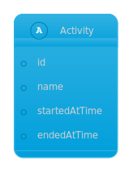
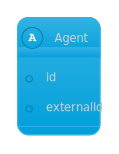
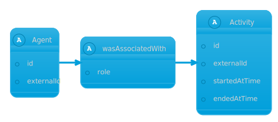
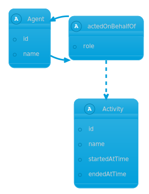
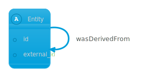
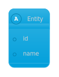
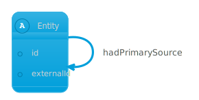
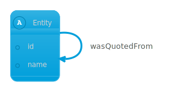
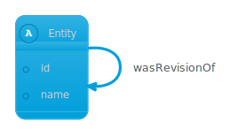

# Provenance concepts

Chronicle uses the [W3C Provenance Ontology](https://www.w3.org/TR/prov-o/) as
the basis for provenance modeling. We present here a summary of the concepts
used and their corresponding mutations and GraphQL query structure.

## Activity

> An activity is something that occurs over a period of time and acts upon or
> with entities; it may include consuming, processing, transforming, modifying,
> relocating, using, or generating entities. Just as entities cover a broad
> range of notions, activities can cover a broad range of notions: information
> processing activities may for example move, copy, or duplicate digital
> entities; physical activities can include driving a car between two locations
> or printing a book.

Activities in Chronicle can be subtyped and contain attributes, specified by
[the domain model](./domain_modeling.md#activity). Activities can be recorded
using [the typed activity mutations](./recording_provenance.md#define-an-activity)
or can be left [untyped](./untyped_chronicle.md#creating-an-activity-in-untyped-chronicle).

## Agent

> An agent is something that bears some form of responsibility for an activity
> taking place, for the existence of an entity, or for another agent's activity.

Agents in Chronicle can be subtyped and contain attributes, specified by
[the domain model agents section](./domain_modeling.md#agent). Agents can be
recorded using [the typed agent mutations](./recording_provenance.md#agent) or
left [untyped](./untyped_chronicle.md#creating-an-agent-in-untyped-chronicle).

## Association

> An activity association is an assignment of responsibility to an agent for an
> activity, indicating that the agent had a role in the activity.

## Delegation

> Delegation is the assignment of authority and responsibility to an agent (by
> itself or by another agent) to carry out a specific activity as a delegate or
> representative, while the agent it acts on behalf of retains some
> responsibility for the outcome of the delegated work. For example, a student
> acted on behalf of his supervisor, who acted on behalf of the department
> chair, who acted on behalf of the university; all those agents are responsible
> in some way for the activity that took place but we do not say explicitly who
> bears responsibility and to what degree.

## Derivation

> A derivation is a transformation of an entity into another, an update of an
> entity resulting in a new one, or the construction of a new entity based on a
> pre-existing entity.

Chronicle allows the three standard prov subtypes of derivation:
[Primary Source](#primary-source), [Quotation](#quotation), and
[Revision](#revision).

## Entity

> In PROV, things we want to describe the provenance of are called entities and
> have some fixed aspects. The term "things" encompasses a broad diversity of
> notions, including digital objects such as a file or web page, physical things
> such as a mountain, a building, a printed book, or a car, as well as abstract
> concepts and ideas. An entity is a physical, digital, conceptual, or other
> kind of thing with some fixed aspects; entities may be real or imaginary.

Entities in Chronicle can be subtyped and contain attributes, specified by
[the domain model](./domain_modeling.md#entity). Entities can be recorded using
[the typed entity mutations](./recording_provenance.md#define-an-entity) or can be
left [untyped](./untyped_chronicle.md#creating-an-entity-in-untyped-chronicle).

### Generation

> Generation is the completion of production of a new entity by an activity.
> This entity did not exist before generation and becomes available for usage
> after this generation.

### Primary Source

> A primary source for a topic refers to something produced by some agent with
> direct experience and knowledge about the topic, at the time of the topic's
> study, without benefit from hindsight. Because of the directness of primary
> sources, they "speak for themselves" in ways that cannot be captured through
> the filter of secondary sources. As such, it is important for secondary
> sources to reference those primary sources from which they were derived, so
> that their reliability can be investigated. A primary source relation is a
> particular case of derivation of secondary materials from their primary
> sources. It is recognized that the determination of primary sources can be up
> to interpretation and should be done according to conventions accepted within
> the application's domain.

### Quotation

> A quotation is the repeat of (some or all of) an entity, such as text or
> image, by someone who may or may not be its original author. Quotation is a
> particular case of derivation.

### Revision

> A revision is a derivation for which the resulting entity is a revised version
> of some original. The implication here is that the resulting entity contains
> substantial content from the original. Revision is a particular case of
> derivation.

## Start and End

### Start

> Start is when an activity is deemed to have been started by an entity, known
> as trigger. The activity did not exist before its start. Any usage, generation,
> or invalidation involving an activity follows the activity's start. A start may
> refer to a trigger entity that set off the activity, or to an activity, known as
> starter, that generated the trigger.

### End

> End is when an activity is deemed to have been ended by an entity, known as
> trigger. The activity no longer exists after its end. Any usage, generation, or
> invalidation involving an activity precedes the activity's end. An end may refer
> to a trigger entity that terminated the activity, or to an activity, known as
> ender that generated the trigger.

### Usage

> Usage is the beginning of utilizing an entity by an activity. Before usage,
> the activity had not begun to utilize this entity and could not have been
> affected by the entity.
